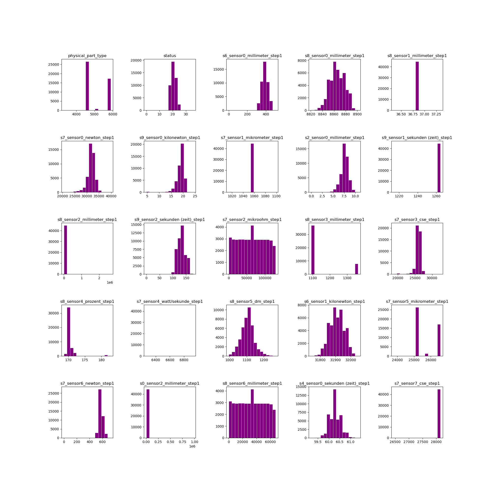

# Our cleaning data journey
The first thing we did in this project was cleaning the data. For us it was an iterative approach as we 
found more and more ways to filter data and alter it for the analysis.
## Dealing with null values:
It was clear that the csv had a lot of empty cells that we needed to either drop or fill. Initally our code checks
what percentage of the cells are empty. If it is above 45% then the column is dropped.

After that we tried 2 approaches:

1. dropping all rows containing nulls, but it removed the whole table so we tried another approach
2. instead we decided to fill them with median or mean value of the column depending on data

If the data was heavily skewed we used the **median value**, but if it wasn't we used the **mean**. 
## Normalization:
After that our code normalized the data to lie in the range between 0 and 1, as the range of values is clearly 
very different for different columns.
## Mapping:
We can only have numbers for our model. Thus, we mapped 'OK' and 'NOK' to 1 and 0 respectively.
## Variance filtering:

After plotting data from different sensors it was clear that a lot of it is heavily concentrated and has low
variance. This data will not be as useful for the model and was dropped.

Also, we dropped the columns that were all null in order to avoid NaN errors.

Afterwards we could see more diverse graphs, where data is less concentrated. (The picture shows the first 25 columns of data plotted as histograms)
## Separation:
We separate the data according to the part type and drop the column with correspinding data as we no longer need it.