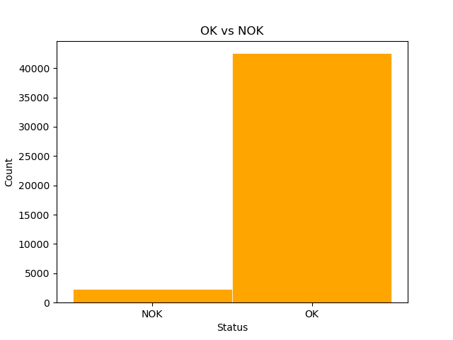
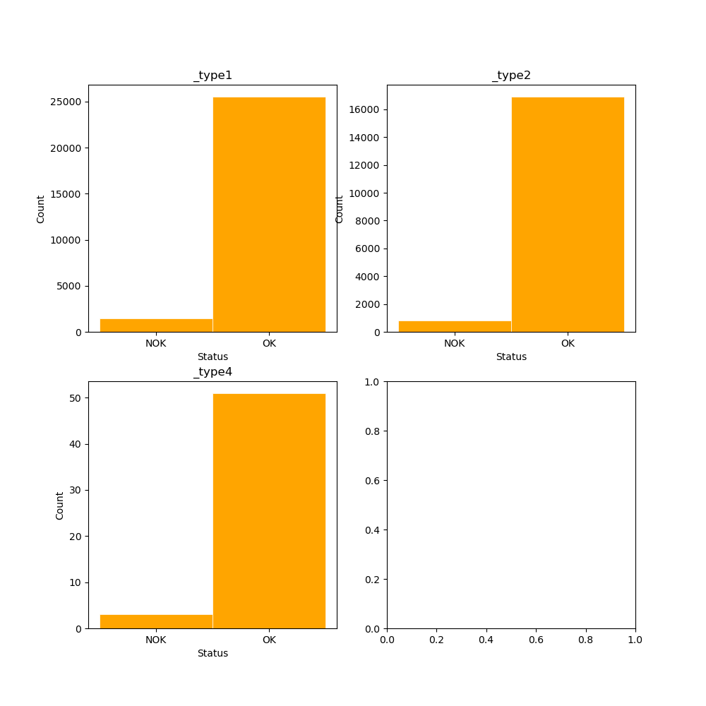

# Model
In this file the filtered and balanced data is used as input for the neural network model.

## Model description:
It receives data and separates the input and output. In our case it is sensor data and type. Then
after several linear layers it outputs to one neuron that can be either 1 or 0. 

Before training the data is separated into train and test samples that will be used later on.

The hidden layer size is 100 and the activation function used is Relu. 

## Training and testing
We have 1 epochs, during which we feed the data through the model and calculate the loss.
The loss values are appended to an array that will be ploted and daved when training is done. 

In order to test our results we use the test sample and calculate the accuracy.

The picture shows the relationship of OK to NOK before balancing in combined and separated dataset.

It stays constant in each part type as well.
